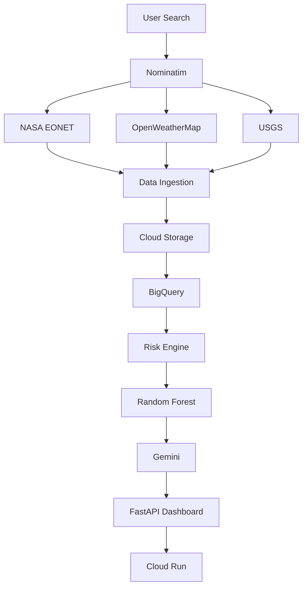
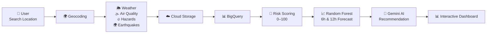

# 🌍 RiskSense AI – AI Powered Outdoor Safety Decision Support


<p align="center">

**Should I go outside now, later, or not today?**

*An AI-powered environmental risk intelligence platform built on Google Cloud.*

</p>

---

## 🚀 Live Demo

🌐 **Application**

https://risksense-ai-789818308989.asia-south1.run.app/

---

# 📖 About the Project

Every day, millions of people make outdoor decisions based on incomplete information.

They check:

* 🌦 Weather apps
* 🌫 Air Quality apps
* 🔥 Wildfire alerts
* 🌍 Earthquake reports
* 📰 Local news

RiskSense AI combines all these sources into **one intelligent decision-support platform** that answers a single question:

> **"Is it safe to go outside?"**

The platform collects live environmental data, processes it through an explainable risk engine, predicts future conditions using Machine Learning, and presents everything in an interactive dashboard with a unified **0–100 Environmental Risk Score**.

#### The application is fully deployed on Google Cloud Run and is publicly accessible through the live demo.
---

# 🎯 Problem Statement

People currently rely on multiple disconnected applications to determine outdoor safety.

RiskSense AI eliminates this fragmentation by combining:

* Weather
* Air Quality
* Wildfires
* Volcanoes
* Earthquakes
* Severe Storms

into a single environmental intelligence platform with actionable recommendations.

---

# 🌍 Real-world Impact

RiskSense AI helps:

* 🚶 Daily commuters
* 🏃 Runners & cyclists
* 👨‍👩‍👧 Parents planning outdoor activities
* 🎪 Event organizers
* ✈️ Travelers
* 👴 Elderly & respiratory-sensitive individuals

Instead of checking several apps, users receive one clear recommendation within seconds.

---

## 🎥 Demo Video

[▶️ Watch Demo Video](Images/Risk-Sense-AI-Demo.mp4)

---

# 📸 Application Screenshots

## Home Page


---

## Environmental Risk Score


---

## Weather and Interactive Hazard Map


---

## Air Quality and AI Summary


---

## Forecast and Score Contribution


---

## Weather Conditions


---

# ✨ Key Features

* 🌍 Worldwide location search
* ⚠️ Unified 0–100 Environmental Risk Score
* 🔥 Multi-hazard monitoring
* 🌫 Air Quality Dashboard
* 🌦 Live Weather Monitoring
* 🌍 Interactive Hazard Map
* 📈 6-hour & 12-hour Machine Learning Forecast
* 🤖 Gemini-powered AI explanations
* ⚡ Live pipeline progress (Server-Sent Events)
* ☁️ Google Cloud deployment
* 📊 Interactive dashboard with charts and maps

---

# 🔄 How It Works

1. User searches for any location.
2. The application geocodes the location.
3. Environmental data is collected from NASA EONET, OpenWeatherMap, and USGS.
4. Data is cleaned, validated, and transformed.
5. The risk engine calculates a 0–100 environmental risk score.
6. A Random Forest model predicts the next 6-hour and 12-hour risk.
7. Gemini generates a natural-language explanation.
8. Results are displayed on an interactive dashboard.

# 📊 Data Sources

| Source                    | Data                                          |
| ------------------------- | --------------------------------------------- |
| NASA EONET                | Wildfires, Volcanoes, Storms, Natural Hazards |
| OpenWeatherMap            | Weather Forecast & Air Quality                |
| USGS                      | Earthquake Data                               |
| Nominatim (OpenStreetMap) | Worldwide Geocoding                           |

---

# 🏗️ Solution Architecture




---

# ⚙️ Technology Stack

## ☁️ Google Cloud

* Cloud Run
* BigQuery
* Cloud Storage
* Gemini API

## 🤖 Machine Learning

* Random Forest Regression
* Scikit-learn

## 🌐 Backend

* Python
* FastAPI
* Uvicorn

## 📊 Frontend

* Jinja2
* Tailwind CSS
* Plotly
* Leaflet

---

## 🔄 End-to-End Decision Pipeline


---

# 📂 Project Structure

```text
project-root/
│
├── configs/
├── data/
├── Images/
├── models/
├── sql/
├── src/
│   ├── api/                  # FastAPI routes & templates
│   ├── dashboard/            # Charts & visualization
│   ├── explain/              # Gemini AI integration
│   ├── features/             # Feature engineering
│   ├── ingestion/            # API connectors (EONET, OWM, USGS)
│   ├── model/                # ML forecasting
│   ├── transform/            # Data transformation
│   ├── database.py           # DuckDB layer
│   └── database_bq.py        # BigQuery layer
├── .dockerignore
├── .env.example
├── .gcloudignore
├── .gitignore
├── Dockerfile
├── requirements.txt
├── start_server.py
└── README.md
```

---

# 🌐 API Endpoints

| Endpoint                | Description                    |
| ----------------------- | ------------------------------ |
| GET /                   | Dashboard                      |
| GET /map                | Interactive Hazard Map         |
| GET /forecast           | Risk Forecast                  |
| GET /explanation        | AI Recommendation              |
| GET /benchmark          | Performance Comparison         |
| GET /api/current        | Current Risk Score             |
| GET /api/forecast       | Forecast JSON                  |
| POST /api/refresh       | Refresh Environmental Pipeline |
| GET /api/refresh/stream | Live Pipeline Progress         |

---

# ☁️ Cloud Deployment

RiskSense AI is fully deployed on **Google Cloud Run**.

Google Cloud services used:

* ✅ Cloud Run
* ✅ BigQuery
* ✅ Cloud Storage
* ✅ Gemini API

The application automatically provisions datasets, stores processed environmental data in BigQuery and Cloud Storage, and scales serverlessly based on user demand.

---

# 🚀 Scalability & Acceleration

RiskSense AI is deployed on **Google Cloud Run** (serverless containers without GPU access). For this reason, **BigQuery** handles large-scale data processing natively — parallelizing queries across thousands of slots without hardware dependencies.

The codebase includes optional **NVIDIA RAPIDS cuDF** integration for GPU-accelerated feature engineering when running in GPU-equipped environments (e.g., local workstations or GKE with GPU nodes), but in the production Cloud Run deployment, BigQuery serves as the scalable compute layer.

---

# 🎯 Why RiskSense AI?

✅ Real-world problem

✅ Decision-support application

✅ Multi-source environmental analytics

✅ Machine Learning forecasting

✅ Explainable AI recommendations

✅ Google Cloud native deployment

---

# 🚀 Future Enhancements

* Mobile application
* Personalized alerts
* Historical trend analytics
* Vertex AI integration
* IoT sensor support
* Real-time streaming updates
* User authentication
* Multi-language AI recommendations

---

# 📄 License

This project was developed as part of the **Gen AI Academy APAC Edition Prototype Submission** and is intended for educational, research, and demonstration purposes.
